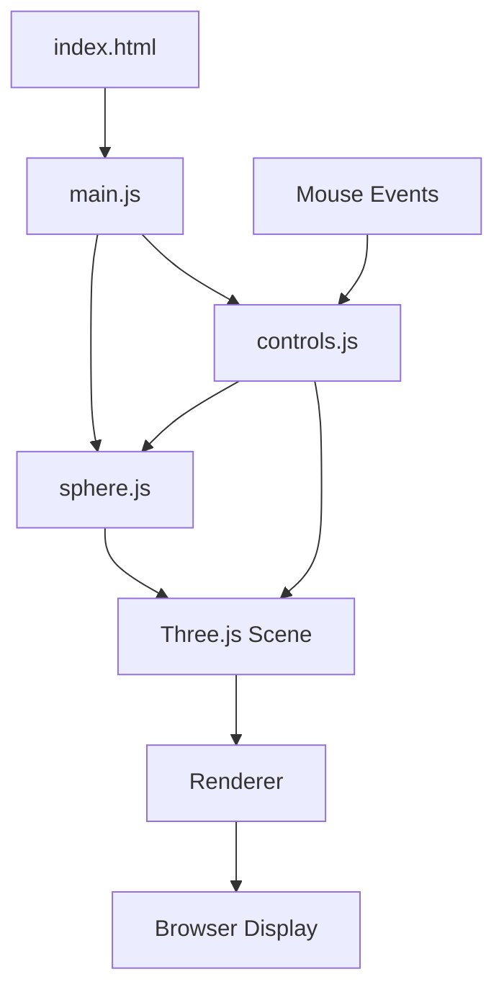

# Interactive Glowing 3D Sphere Project Plan

## Project Overview
Create a web-based 3D sphere that:
- Spins automatically
- Glows with adjustable intensity
- Rotates when dragged with the mouse
- Changes glow intensity when hovered

## Project Structure

```
glowing-sphere/
├── index.html          # Main HTML file
├── css/
│   └── style.css       # Styling for the application
├── js/
│   ├── main.js         # Main application logic
│   ├── sphere.js       # Sphere creation and effects
│   └── controls.js     # Mouse interaction handling
└── lib/
    └── three.min.js    # Three.js library (if not using CDN)
```

## Implementation Details

### 1. Setting Up the Project

We'll start by creating the basic project structure and including Three.js. We have two options:
- Use Three.js via CDN (simpler for small projects)
- Download Three.js and include it locally (better for production)

For this project, we'll use the CDN approach for simplicity.

### 2. Creating the 3D Scene

The core components of our Three.js application will include:
- Scene: The container for all 3D objects
- Camera: Defines what we see (perspective camera)
- Renderer: Renders the scene using WebGL
- Lighting: To illuminate the sphere
- The sphere itself: Our main 3D object

### 3. Implementing the Glowing Effect

For the glowing effect, we'll use a combination of:
- A shader material for the sphere
- A bloom post-processing effect using Three.js EffectComposer
- Dynamic intensity control based on mouse hover

### 4. Mouse Interactions

We'll implement two types of mouse interactions:
1. **Dragging to rotate**: Using Three.js OrbitControls for smooth rotation
2. **Hover to change glow intensity**: Custom event listeners to detect mouse position relative to the sphere

### 5. Animation

We'll implement:
- A default gentle spinning animation when not being interacted with
- Smooth transitions between user-controlled rotation and automatic spinning

## Application Architecture



## Technical Considerations

1. **Performance Optimization**:
   - Use appropriate polygon count for the sphere
   - Optimize shader complexity
   - Use requestAnimationFrame for smooth animation

2. **Responsive Design**:
   - Adjust camera and renderer based on window size
   - Handle touch events for mobile devices

3. **Browser Compatibility**:
   - Ensure WebGL support detection
   - Provide fallback for browsers without WebGL support

## Implementation Steps

1. **Set up the project structure**
   - Create the directory structure
   - Create empty files for HTML, CSS, and JavaScript

2. **Install and set up Three.js**
   - Include Three.js via CDN
   - Include necessary Three.js extensions (OrbitControls, EffectComposer, etc.)

3. **Create a basic HTML page with a canvas element**
   - Set up the HTML structure
   - Create a full-screen canvas element
   - Add necessary meta tags for responsive design

4. **Initialize Three.js scene, camera, and renderer**
   - Set up the scene
   - Configure the camera with appropriate position and field of view
   - Initialize the WebGL renderer
   - Add window resize handling

5. **Create a 3D sphere with basic materials**
   - Create a sphere geometry
   - Apply a basic material
   - Add the sphere to the scene

6. **Implement the glowing effect for the sphere**
   - Set up shader materials
   - Configure bloom post-processing
   - Create parameters for adjusting glow intensity

7. **Add automatic spinning animation**
   - Implement the animation loop
   - Add rotation logic
   - Ensure smooth animation using requestAnimationFrame

8. **Implement mouse drag interaction for rotating the sphere**
   - Set up OrbitControls
   - Configure drag sensitivity
   - Handle transition between automatic rotation and user control

9. **Implement hover interaction to change glow intensity**
   - Add event listeners for mouse movement
   - Calculate if mouse is hovering over the sphere
   - Adjust glow intensity based on hover state

10. **Add responsive design for different screen sizes**
    - Update renderer and camera on window resize
    - Ensure proper display on mobile devices
    - Handle touch events as alternatives to mouse events

11. **Optimize performance**
    - Analyze and optimize render loop
    - Adjust quality settings based on device capabilities
    - Implement loading indicators if necessary

12. **Test across different browsers**
    - Test on Chrome, Firefox, Safari, and Edge
    - Verify mobile browser compatibility
    - Address any browser-specific issues

13. **Document the code**
    - Add comments to explain complex parts
    - Create a README with setup and usage instructions
    - Document any known limitations or future improvements